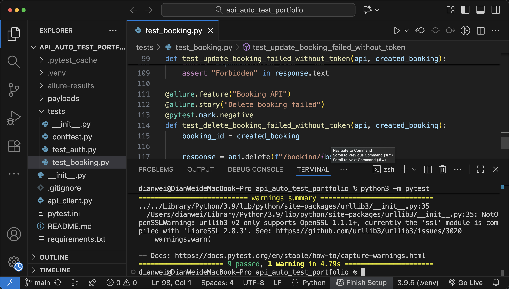
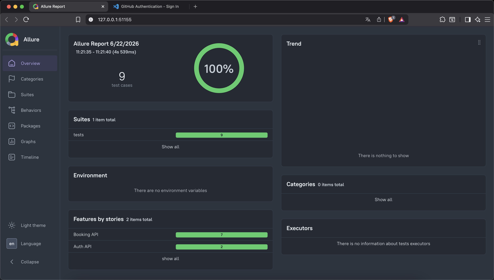

# RESTful API Automation Test Framework

This is a portfolio project for API automation testing.
The project uses Python, Pytest, Requests, and Allure Report to test RESTful API workflows, including authentication and CRUD operations.

## Project Purpose

The purpose of this project is to demonstrate basic API automation testing skills, including:

* Building an API automation test framework
* Sending API requests with Python Requests
* Writing test cases with Pytest
* Validating status code, response body, JSON fields, and error messages
* Managing authentication token with Pytest fixtures
* Generating visual test reports with Allure Report

## Tech Stack

* macOS
* VS Code
* Python
* Pytest
* Requests
* Allure Report
* RESTful API
* Git / GitHub

## Test Scope

This project includes the following API test scenarios:

* Login success
* Login failed with wrong password
* Create booking
* Get booking
* Update booking
* Delete booking

## Project Structure

```text
api_auto_test_portfolio/
├── api_client.py
├── payloads/
│   └── booking_payload.py
├── tests/
│   ├── __init__.py
│   ├── conftest.py
│   ├── test_auth.py
│   └── test_booking.py
├── pytest.ini
├── requirements.txt
├── README.md
└── .gitignore
```

## Environment Setup

### 1. Create a virtual environment

```bash
python3 -m venv .venv
```

### 2. Activate the virtual environment

```bash
source .venv/bin/activate
```

### 3. Install dependencies

```bash
python -m pip install --upgrade pip
python -m pip install -r requirements.txt
```

## Run Test Cases

## Test Result

ß

## Allure Report



Run all test cases:

```bash
python -m pytest
```

Run tests with detailed output:

```bash
python -m pytest -v
```

## Generate Allure Report

Run tests and generate Allure result files:

```bash
python -m pytest --alluredir=allure-results
```

Open Allure report:

```bash
allure serve allure-results
```

## Test Result Example

After running the test cases, the result should show passed test cases:

```text
tests/test_auth.py::test_login_success PASSED
tests/test_auth.py::test_login_failed_with_wrong_password PASSED
tests/test_booking.py::test_create_booking PASSED
tests/test_booking.py::test_get_created_booking PASSED
tests/test_booking.py::test_update_booking PASSED
tests/test_booking.py::test_delete_booking PASSED
```

## Key Features

### API Client Layer

The `api_client.py` file wraps common HTTP methods, including:

* GET
* POST
* PUT
* DELETE

This makes the test cases cleaner and easier to maintain.

### Test Data Management

The `payloads/booking_payload.py` file manages request body data for booking-related API tests.

This helps separate test data from test logic.

### Pytest Fixture

The `tests/conftest.py` file provides shared fixtures for:

* API client initialization
* Token generation
* Test booking creation
* Test data cleanup

### Assertion Coverage

The test cases validate:

* HTTP status code
* Response body
* JSON field values
* Error messages
* Token-based authorization

## Portfolio Summary

This project demonstrates my ability to build and execute API automation tests using Python.
It also shows my understanding of test structure, fixture usage, request payload management, API response validation, and test report generation.

## Author

Created by Nori as an API automation testing portfolio project.
