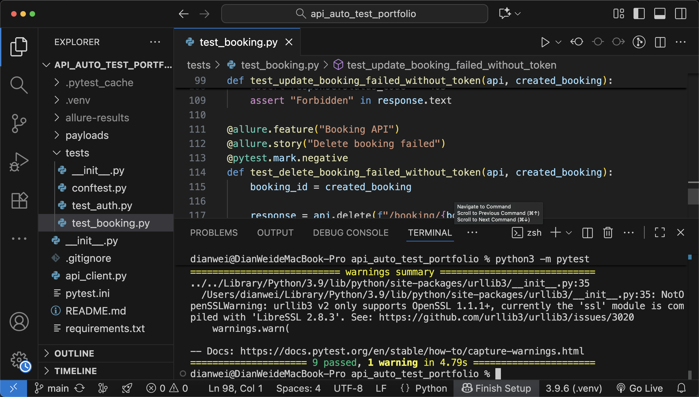
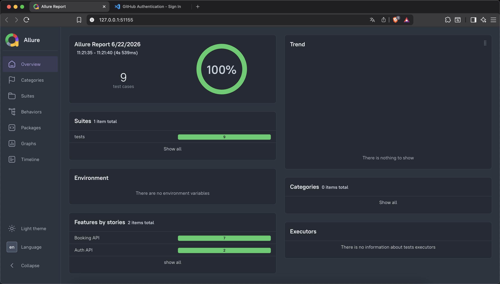

# REST API Automation Framework

A maintainable API test framework for validating authentication and end-to-end booking workflows. The project separates HTTP operations, test payloads, shared fixtures, and assertions so the suite can be extended without duplicating request logic.

## What It Validates

| Area | Coverage |
|---|---|
| Authentication | Successful login and invalid credentials |
| Booking workflow | Create, read, update, and delete |
| API contract | Status codes, response fields, and error messages |
| Test lifecycle | Shared setup, authentication token, booking creation, and cleanup |

## Architecture

```text
Pytest Test Case
      ↓
Shared Fixtures
      ↓
Reusable API Client
      ↓
REST API
      ↓
Response Assertions
```

## Key Engineering Decisions

- `ApiClient` centralizes URL construction, headers, sessions, and HTTP methods.
- Pytest fixtures manage authentication and reusable test setup.
- Booking payloads are separated from test logic.
- CRUD scenarios are validated as a connected workflow rather than isolated requests.
- Allure results provide reviewable execution evidence.

## Tech Stack

Python · Pytest · Requests · Allure · REST API

## Project Structure

```text
api-auto-test-portfolio/
├── api_client.py
├── payloads/
│   └── booking_payload.py
├── tests/
│   ├── conftest.py
│   ├── test_auth.py
│   └── test_booking.py
├── screenshots/
├── pytest.ini
├── requirements.txt
└── README.md
```

## Run Locally

```bash
python -m venv .venv
```

Windows PowerShell:

```powershell
.\.venv\Scripts\Activate.ps1
python -m pip install -r requirements.txt
python -m pytest -v
```

macOS / Linux:

```bash
source .venv/bin/activate
python -m pip install -r requirements.txt
python -m pytest -v
```

## Generate Allure Report

```bash
python -m pytest --alluredir=allure-results
allure serve allure-results
```

## Test Evidence





## Portfolio Value

This project demonstrates practical API automation skills: reusable client design, fixture-based test lifecycle management, authentication handling, end-to-end CRUD validation, negative testing, and report-driven result review.

## Interview Talking Points

- Why centralize requests in an API client instead of calling `requests` directly in every test?
- How do fixtures reduce duplicated setup and improve cleanup reliability?
- Which assertions are most important beyond checking only the HTTP status code?
- How would this framework support multiple environments such as development, QA, and staging?
- How would the suite be integrated into GitHub Actions or Jenkins?

## Resume Highlight

> Built a Python API automation framework with Pytest and Requests to validate authentication and end-to-end CRUD workflows, using reusable fixtures, separated payload management, response assertions, and Allure reporting.
